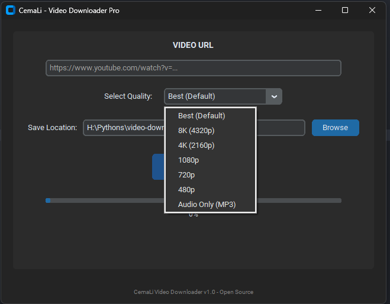

# Video Downloader Pro

**Video Downloader Pro** is a small cross-platform GUI app (Tkinter + yt-dlp) that downloads videos with a progress bar and optional ffmpeg merging. This repository contains ready-to-publish files and build instructions to create a Windows executable.

## Features

- Simple GUI using Tkinter
- Progress bar and percent label
- Optional ffmpeg location bundling
- Safe filename sanitization
- Cross-platform considerations (Windows/Mac/Linux)

## Preview



## Quick start (dev)

1. Clone the repo:

```bash
git clone https://github.com/C3maLi/video-downloader-pro.git
cd video-downloader-pro
```

2. Create virtual environment & install:

```bash
python -m venv .venv
source .venv/bin/activate # mac/linux
.\.venv\Scripts\activate # windows
pip install -r requirements.txt
```

3. Run:

```bash
python -m src.main
```

## Build Windows standalone EXE (recommended)

1. Install PyInstaller (included in `dev` extras in `requirements.txt`)
2. Put `ffmpeg.exe` next to the built exe if you want bundled ffmpeg
3. Run build script (see `release_build_instructions.md`)

## Usage

- Paste a video URL (YouTube, Vimeo, many supported sites)
- Choose folder (defaults to `Downloads` inside app dir)
- Click **DOWNLOAD VIDEO**

## Notes on legality

**Don't use this tool to download copyrighted content you don't have rights to.** See `SECURITY.md` for details.

## Contributing

See `CONTRIBUTING.md`.

## License

MIT — see `LICENSE` file.
